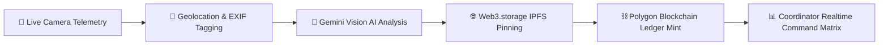

<div align="center">

  

  # 🌿 GROUNDWORK
  ### AI-Verified Disaster Micro-Relief Network & Immutable Public Ledger

  [](https://nextjs.org/)
  [](https://fastapi.tiangolo.com/)
  [](https://supabase.com/)
  [](https://ai.google.dev/)
  [](https://polygon.technology/)
  [](https://www.typescriptlang.org/)

  <p align="center">
    <b>A humanitarian relief platform for India (Aapda Mitra scheme), providing real-time task dispatching, live browser camera proof telemetry, Gemini Vision AI verification, and Polygon blockchain immutable ledger minting.</b>
  </p>

</div>

---

## 📌 Executive Summary & Architecture

Groundwork bridges the gap between field disaster relief volunteers and regional sector coordinators. It prevents relief fraud, duplicate item claims, and delivery spoofing through a 5-step automated telemetry pipeline:



---

## ✨ Key Features

### 👨‍🚒 Volunteer Portal (`/dashboard/volunteer`)
- **Dynamic Personalized Hub**: Time-aware greeting banner displaying active relief sector, district, and ward assignment.
- **Live Stats Bar**: Real-time counts for `Verified`, `Pending`, and `On Ledger ⛓` tasks.
- **Self-Pledge Task Modal**: Volunteers can initiate relief pledges (e.g. 50x Potable Water Canisters) which write directly to the database.
- **Camera-Only Telemetry Capture (`/dashboard/volunteer/submit`)**: Browser-native `getUserMedia` camera feed with viewfinder overlay and live GPS capture. **File pickers are strictly disabled to prevent spoofing.**
- **Instant AI Verification Result**: Displays verdict badge, Gemini AI confidence %, face detection confirmation, cargo payload visibility, IPFS CID link, and Polygon transaction hash.
- **Submission History (`/dashboard/volunteer/history`)**: Chronological ledger history with expandable card previews, AI analysis notes, and IPFS/Blockchain links.

### 🛡 Coordinator Command Matrix (`/dashboard/coordinator`)
- **Real-Time Operations Dashboard**: High-level telemetry for active volunteers, tasks, verified fulfillments, and minted ledger blocks.
- **Verification & Audit Queue (`/dashboard/coordinator/verification`)**: Live queue to review incoming proof imagery, inspect AI confidence scores, and trigger automated Polygon blockchain writes.
- **Live Task Dispatcher (`/dashboard/coordinator/tasks`)**: Create and dispatch tasks directly to registered Aapda Mitra volunteers with instant real-time UI updates via Supabase WebSockets.

---

## 🛠 Tech Stack

| Layer | Technology |
|---|---|
| **Frontend** | Next.js 14 (App Router), React 18, TypeScript, Tailwind CSS, Framer Motion, Motion Primitives |
| **Backend** | Python 3.10+, FastAPI, Uvicorn, Base64 Image Processing |
| **Database & Auth** | Supabase PostgreSQL, Row Level Security (RLS), Supabase Auth (`@supabase/ssr`) |
| **Artificial Intelligence** | Google Gemini Vision AI (`gemini-1.5-flash`) via `google-generativeai` |
| **Storage & Ledger** | Web3.storage (IPFS), Thirdweb SDK, Polygon Blockchain (Solidity Smart Contract) |

---

## 📁 Repository Structure

```text
GROUNDWORK/
├── app/                        # Next.js App Router Pages & Layouts
│   ├── auth/                   # Signup and Signin Pages (Supabase Auth)
│   ├── dashboard/
│   │   ├── volunteer/          # Volunteer Portal, Submit Camera, History
│   │   └── coordinator/        # Command Matrix, Verification Queue, Live Tasks
├── backend/                    # FastAPI Python Backend
│   ├── main.py                 # FastAPI Application & CORS Setup
│   ├── requirements.txt        # Python Dependencies
│   └── routes/                 # Endpoint Handlers
│       ├── verify.py           # Gemini Vision AI Verification Endpoint
│       ├── blockchain.py       # Thirdweb Polygon Blockchain Writer
│       └── tasks.py            # Task Assignment, Pledges & IPFS Upload
├── components/                 # React UI Components
│   ├── AuthProvider.tsx        # Supabase Auth Context
│   ├── TaskCard.tsx            # Interactive Task Card Component
│   ├── HistoryEntry.tsx        # Expandable Submission History Card
│   └── ui/                     # Status Badges, Stat Cards, Activity Feed
├── contracts/
│   └── GroundworkVerification.sol # Solidity Smart Contract for Polygon
├── lib/                        # Supabase Client & Server Helpers
└── supabase/
    └── schema.sql              # PostgreSQL DDL for profiles, tasks, submissions + RLS
```

---

## 🚀 Quick Start Guide

### 1. Prerequisites
- Node.js `v18.0.0+`
- Python `v3.10+`
- Supabase Account

### 2. Database Initialization
Copy the contents of [`supabase/schema.sql`](file:///d:/Srujana/PROJECTS/HACKMATRIX/groundwork/supabase/schema.sql) and execute them in your [Supabase SQL Editor](https://supabase.com/dashboard). This creates the `profiles`, `tasks`, and `submissions` tables along with Row Level Security (RLS) policies.

### 3. Environment Configuration
Verify your active environment files:

- **Frontend Environment** ([`.env.local`](file:///d:/Srujana/PROJECTS/HACKMATRIX/groundwork/.env.local)):
  ```env
  NEXT_PUBLIC_SUPABASE_URL=https://eeewqngervwvwlpcxpcm.supabase.co
  NEXT_PUBLIC_SUPABASE_ANON_KEY=your_supabase_anon_key
  NEXT_PUBLIC_BACKEND_URL=http://localhost:8000
  ```

- **Backend Environment** ([`backend/.env`](file:///d:/Srujana/PROJECTS/HACKMATRIX/groundwork/backend/.env)):
  ```env
  SUPABASE_URL=https://eeewqngervwvwlpcxpcm.supabase.co
  SUPABASE_SERVICE_ROLE_KEY=your_service_role_key
  GEMINI_API_KEY=your_google_gemini_api_key
  WEB3_STORAGE_TOKEN=your_web3_storage_token
  THIRDWEB_PRIVATE_KEY=your_polygon_wallet_private_key
  CONTRACT_ADDRESS=your_deployed_contract_address
  ```

### 4. Running the Platform

#### Step A — Launch FastAPI Backend
```bash
cd backend
pip install -r requirements.txt
uvicorn main:app --reload --port 8000
```
*Backend will run at `http://localhost:8000` with interactive API docs at `http://localhost:8000/docs`.*

#### Step B — Launch Next.js Frontend
```bash
npm run dev
```
*Frontend will run at `http://localhost:3000`.*

---

## 📜 Smart Contract Specification

The Polygon verification contract ([`contracts/GroundworkVerification.sol`](file:///d:/Srujana/PROJECTS/HACKMATRIX/groundwork/contracts/GroundworkVerification.sol)) enforces immutable on-chain record keeping:

```solidity
// SPDX-License-Identifier: MIT
pragma solidity ^0.8.0;

contract GroundworkVerification {
    struct VerificationRecord {
        string volunteerId;
        string taskId;
        string ipfsCid;
        uint256 timestamp;
        string verdict;
    }
    
    VerificationRecord[] public records;
    event RecordAdded(string volunteerId, string taskId, string ipfsCid, uint256 timestamp);
    
    function recordVerification(
        string memory volunteerId,
        string memory taskId,
        string memory ipfsCid,
        uint256 timestamp,
        string memory verdict
    ) public {
        records.push(VerificationRecord(volunteerId, taskId, ipfsCid, timestamp, verdict));
        emit RecordAdded(volunteerId, taskId, ipfsCid, timestamp);
    }
}
```

---

## 🤝 License & Disclaimer
Built for the **Groundwork Disaster Relief Initiative**. Designed to support national disaster response frameworks including Aapda Mitra (NDRF) across India.
